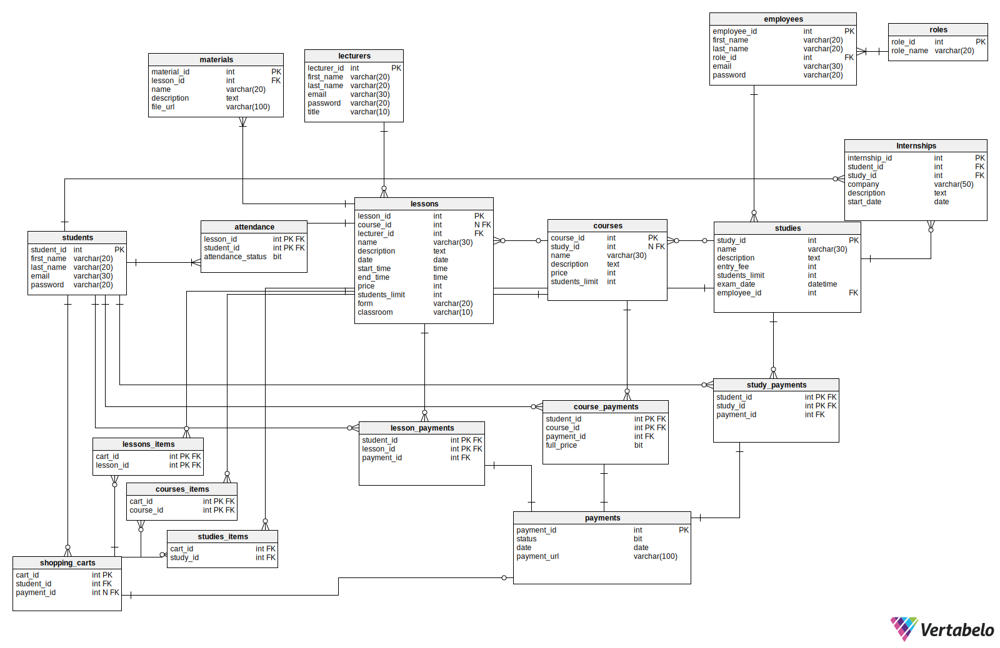

# Bazy danych - System zarządzania szkoleniami
Krzysztof Śliwiński
Hubert Kasprzycki
Artur Dwornik


## Funkcje realizowane przez system:
1. Pracownicy zarządzający wydarzeniami:
    * Zarządzanie kursami, webinarami i studiami: 
        * Dodawanie nowych kursów, webinarów i studiów. 
        * Edycja istniejących wydarzeń (w tym harmonogramu). 
        * Usuwanie wydarzeń (zarówno bieżących, jak i archiwizowanych). 
    * Zarządzanie użytkownikami: 
        * Dodawanie nowych użytkowników do systemu. 
        * Edycja danych użytkowników. 
        * Dezaktywacja użytkowników. 
        * Wpisanie użytkownika na listę dłużników. 
    * Generowanie raportów: 
        * Raport ogólny z zapisanych osób na przyszłe wydarzenia. 
        * Raport frekwencji na zakończonych wydarzeniach. 
        * Lista obecności dla każdego szkolenia. 
        * Raport bilokacji – lista osób zapisanych na kolidujące ze sobą wydarzenia. 

2. Pracownicy biurowi: 
    * Generowanie raportów: 
        * Raport finansowy - zestawienie przychodów z poszczególnych wydarzeń. 
        * Lista dłużników - sprawozdanie zalegających z płatnościami użytkowników. 
        * Raport ogólny z zapisanych osób na przyszłe wydarzenia. 
        * Raport frekwencji na zakończonych wydarzeniach. 
        * Lista obecności dla każdego szkolenia. 
        * Raport bilokacji – lista osób zapisanych na kolidujące ze sobą wydarzenia. 
	 
 3. Wykładowca: 
    * Edycja prowadzonych wydarzeń. 
    * Oznaczanie obecności: 
        * Oznaczanie obecności uczestników w trakcie spotkań. 
        * Modyfikowanie listy obecności (oznaczenie odrobienia zajęć w przypadku studiów) 
    * Dodawanie materiałów: 
        * Wykładowca może dodawać materiały do kursów, takie jak prezentacje, pliki do pobrania itp. 
 
4.  Uczestnik: 
    * Przeglądanie oferty: 
        * Przeglądanie dostępnych kursów, webinarów i studiów. 
        * Przeglądanie sylabusów studiów, 
    * Rejestracja i płatności: 
        * Rejestracja na wybrane wydarzenia. 
        * Dodawanie wydarzeń do koszyka. 
        * Generowanie linku do płatności. 
        * Uiszczenie opłat za uczestnictwo w wydarzeniach. 
    * Dostęp do nagrań: 
        * Dostęp do nagrań z różnych wydarzeń online. 
        * Przeglądanie dostępnych nagrań przez okres 30 dni. 
    * Przeglądanie danych: 
        * Uczestnik może przeglądać swoje płatności i historię uczestnictwa. 

## Diagram bazy danych:




#### Dodatkowe informacje do diagramu
* Wpis w tabeli `internships` oznacza, że student dostarczył zaświadczenie z firmy zewnętrznej o ukończeniu 14 dniowych praktyk ze 100% frekwencją w ramach danych studiów.

## Tabele

### Pracownicy
``` sql
CREATE TABLE employees (
   employee_id int  NOT NULL IDENTITY(1, 1),
   first_name varchar(20)  NOT NULL,
   last_name varchar(20)  NOT NULL,
   role_id int  NOT NULL,
   email varchar(30)  NOT NULL,
   password varchar(20)  NOT NULL,
   CONSTRAINT employees_ak_1 UNIQUE (email),
   CONSTRAINT employees_pk PRIMARY KEY  (employee_id)
);

```
### Role pracowników
``` sql
CREATE TABLE roles (
   role_id int  NOT NULL IDENTITY(1,1),
   role_name varchar(20)  NOT NULL,
   CONSTRAINT roles_pk PRIMARY KEY  (role_id)
);
```

### Studenci
``` sql
CREATE TABLE students (
   student_id int  NOT NULL IDENTITY(1, 1),
   first_name varchar(20)  NOT NULL,
   last_name varchar(20)  NOT NULL,
   email varchar(30)  NOT NULL,
   password varchar(20)  NOT NULL,
   CONSTRAINT students_ak_1 UNIQUE (email),
   CONSTRAINT students_pk PRIMARY KEY  (student_id)
);
```

### Lista obecności
``` sql
CREATE TABLE attendance (
   lesson_id int  NOT NULL,
   student_id int  NOT NULL,
   status bit  NOT NULL DEFAULT 0,
   CONSTRAINT attendance_pk PRIMARY KEY  (lesson_id,student_id)
);
```

### Materiały do lekcji online
``` sql
CREATE TABLE materials (
   material_id int  NOT NULL IDENTITY(1, 1),
   lesson_id int  NOT NULL,
   name varchar(20)  NOT NULL,
   description varchar(max)  NOT NULL DEFAULT 'no description found',
   file_url varchar(100)  NOT NULL,
   CONSTRAINT materials_ak_1 UNIQUE (file_url),
   CONSTRAINT materials_pk PRIMARY KEY  (material_id)
);
```

### Wykładowcy
``` sql
CREATE TABLE lecturers (
   lecturer_id int  NOT NULL IDENTITY(1,1),
   first_name varchar(20)  NOT NULL,
   last_name varchar(20)  NOT NULL,
   email varchar(30)  NOT NULL,
   password varchar(20)  NOT NULL,
   title varchar(10)  NULL,
   CONSTRAINT lecturers_ak_1 UNIQUE (email),
   CONSTRAINT lecturers_pk PRIMARY KEY  (lecturer_id)
);
```

### Praktyki zawodowe
``` sql
CREATE TABLE internships (
   internship_id int  NOT NULL IDENTITY(1,1),
   student_id int  NOT NULL,
   study_id int  NOT NULL,
   company varchar(50)  NOT NULL,
   description varchar(max)  NOT NULL DEFAULT 'no description found',
   start_date date  NOT NULL,
   CONSTRAINT Internships_pk PRIMARY KEY  (internship_id)
);
```

### Lekcje (z kursów i studiów) i webinary
``` sql
CREATE TABLE lessons (
   lesson_id int  NOT NULL IDENTITY(1, 1),
   course_id int  NULL,
   lecturer_id int  NOT NULL,
   name varchar(30)  NOT NULL,
   description varchar(max)  NOT NULL DEFAULT 'no description found',
   date date  NOT NULL,
   start_time time  NOT NULL,
   end_time time  NOT NULL,
   price smallmoney  NULL,
   extended_price smallmoney  NULL,
   students_limit int  NULL,
   classroom varchar(10)  NOT NULL,
   translator_id int  NULL,
   CONSTRAINT data CHECK (start_time < end_time),
   CONSTRAINT students_limit_lessons CHECK (students_limit > 0),
   CONSTRAINT price CHECK (price > 0),
   CONSTRAINT extended_price CHECK (extended_price > 0),
   CONSTRAINT lessons_pk PRIMARY KEY  (lesson_id)
);
```

### Kursy
``` sql
CREATE TABLE courses (
   course_id int  NOT NULL IDENTITY(1, 1),
   study_id int  NULL,
   name varchar(30)  NOT NULL,
   description varchar(max)  NOT NULL DEFAULT 'no description found',
   entry_price smallmoney  NULL,
   full_price smallmoney  NULL,
   students_limit int  NULL,
   CONSTRAINT entry_price CHECK (entry_price > 0),
   CONSTRAINT full_price CHECK (full_price > 0),
   CONSTRAINT students_limit CHECK (students_limit > 0),
   CONSTRAINT courses_pk PRIMARY KEY  (course_id)
);
```

### Studia
``` sql
CREATE TABLE studies (
   study_id int  NOT NULL IDENTITY(1, 1),
   name varchar(30)  NOT NULL,
   description varchar(max)  NOT NULL DEFAULT 'no description found',
   entry_fee smallmoney  NOT NULL,
   students_limit int  NOT NULL,
   exam_date datetime  NULL,
   employee_id int  NOT NULL,
   CONSTRAINT entry_fee CHECK (entry_fee > 0),
   CONSTRAINT students_limit_studies CHECK (students_limit > 0),
   CONSTRAINT studies_pk PRIMARY KEY  (study_id)
);
```

### Płatności
``` sql
CREATE TABLE payments (
   payment_id int  NOT NULL IDENTITY(1,1),
   status bit  NOT NULL DEFAULT 0,
   date date  NOT NULL,
   payment_url varchar(100)  NOT NULL,
   CONSTRAINT payments_pk PRIMARY KEY  (payment_id)
);
```

### Płatności za lekcje
``` sql
CREATE TABLE lesson_payments (
   student_id int  NOT NULL,
   lesson_id int  NOT NULL,
   payment_id int  NOT NULL,
   is_extended bit  NOT NULL,
   CONSTRAINT lesson_payments_pk PRIMARY KEY  (student_id,lesson_id)
);
```

### Płatności za kursy
``` sql
CREATE TABLE course_payments (
   student_id int  NOT NULL,
   course_id int  NOT NULL,
   payment_id int  NOT NULL,
   is_full_price bit  NOT NULL DEFAULT 0,
   CONSTRAINT course_payments_pk PRIMARY KEY  (student_id,course_id)
);
```

### Płatności za studia
``` sql
CREATE TABLE study_payments (
   student_id int  NOT NULL,
   study_id int  NOT NULL,
   payment_id int  NOT NULL,
   CONSTRAINT study_payments_pk PRIMARY KEY  (student_id,study_id)
);
```

## Widoki

### 1. Raporty finansowe

#### Przychody dla studiów
```sql
CREATE VIEW studies_income AS
with t as (select lp.lesson_id, l.price, l.extended_price, s.study_id, lp.is_extended
           from lesson_payments lp
                    join lessons l
                         on lp.lesson_id = l.lesson_id
                    join courses c
                         on l.course_id = c.course_id
                    join studies s
                         on c.study_id = s.study_id
                    join payments p
                        on lp.payment_id = p.payment_id and p.status = 1)
select s.study_id,
       round((select count(*)
              from study_payments sp
                    join payments p
                        on sp.payment_id = p.payment_id and p.status = 1
              where sp.study_id = s.study_id) * s.entry_fee
                 +
             (select isnull(sum(t.price*t.is_extended + t.extended_price*abs(t.is_extended - 1)), 0)
              from t
              where t.study_id = s.study_id)
           , 2) as income
from studies s
```

#### Przychody dla kursów
```sql
CREATE VIEW courses_income AS
with t as (select cp.course_id, cp.is_full_price
            from course_payments cp
                join payments p
                    on cp.payment_id = p.payment_id and p.status = 1)
select c.course_id,
       round((select count(*)
            from t
            where t.course_id = c.course_id and t.is_full_price = 1) * c.full_price
            +
           (select count(*)
            from t
            where t.course_id = c.course_id and t.is_full_price = 0) * c.entry_price, 2) as income
from courses c
where c.study_id is null
```

#### Przychody dla webinarów
```sql
CREATE VIEW webinars_income AS
with t as (select l.lesson_id, count(lp.lesson_id) as counter
            from lessons l
                join lesson_payments lp
                    on l.lesson_id = lp.lesson_id
                join payments p
                    on lp.payment_id = p.payment_id and p.status = 1
            where l.course_id is null
            group by l.lesson_id)
select t.lesson_id, t.counter * l.price as income
from t
    join lessons l
        on l.lesson_id = t.lesson_id
```

### 2. Lista „dłużników”
```sql
CREATE VIEW debtors_list AS
select distinct s.student_id
from students s
    join attendance a
        on s.student_id = a.student_id and a.status = 1
    join lessons l
        on a.lesson_id = l.lesson_id and l.course_id is null
    left join lesson_payments lp
        on s.student_id = lp.student_id and a.lesson_id = lp.lesson_id
    left join payments p
        on lp.payment_id = p.payment_id
where lp.student_id is null or p.status = 0
union
select distinct s.student_id
from students s
    join attendance a
        on s.student_id = a.student_id and a.status = 1
    join lessons l
        on a.lesson_id = l.lesson_id
    join courses c
        on l.course_id = c.course_id and c.study_id is null
    left join course_payments cp
        on s.student_id = cp.student_id and c.course_id = cp.course_id
    left join payments p
        on cp.payment_id = p.payment_id
where cp.student_id is null or p.status = 0 or cp.is_full_price = 0
union
select distinct s.student_id
from students s
    join attendance a
        on s.student_id = a.student_id and a.status = 1
    join lessons l
        on a.lesson_id = l.lesson_id
    join courses c
        on l.course_id = c.course_id
    join studies st
        on c.study_id = st.study_id
    left join lesson_payments lp
        on s.student_id = lp.student_id and a.lesson_id = lp.lesson_id
    left join study_payments sp
        on s.student_id = sp.student_id and st.study_id = sp.study_id
    left join payments p
        on lp.payment_id = p.payment_id
where lp.student_id is null or sp.student_id is null or p.status = 0
```

### 4. Ogólny raport dotyczący frekwencji na zakończonych już wydarzeniach
``` sql
CREATE VIEW attendance_percentage_report AS 
    WITH 
        attendanceTotal AS (
            SELECT 
                l.lesson_id, 
                COUNT(*) as count
            FROM lessons l
            JOIN attendance a on l.lesson_id=a.lesson_id
            WHERE l.date < GETDATE()
            GROUP BY l.lesson_id
        ),
        attendancePresent AS (
            SELECT 
                l.lesson_id, 
                COUNT(*) as count
            FROM lessons l
            JOIN attendance a on l.lesson_id=a.lesson_id
            WHERE l.date < GETDATE() AND a.[status]=1
            GROUP BY l.lesson_id
        )
    SELECT 
        att.lesson_id,
        CONCAT(CAST(atp.count as float)/CAST(att.count as float)  * 100, '%') as "Attendance Percentage"
    FROM attendanceTotal att
    JOIN attendancePresent atp on att.lesson_id=atp.lesson_id

```

### 5. Lista Obecności
``` sql
CREATE VIEW attendance_list AS (
    select 
        l.lesson_id,
        l.[date],
        s.first_name,
        s.last_name,
        (
            CASE
                WHEN a.status=0 THEN 'ABSENT'
                ELSE 'PRESENT'
            END
        ) as "status"
    from lessons l
    join attendance a on l.lesson_id=a.lesson_id
    join students s on a.student_id=s.student_id
)
```
