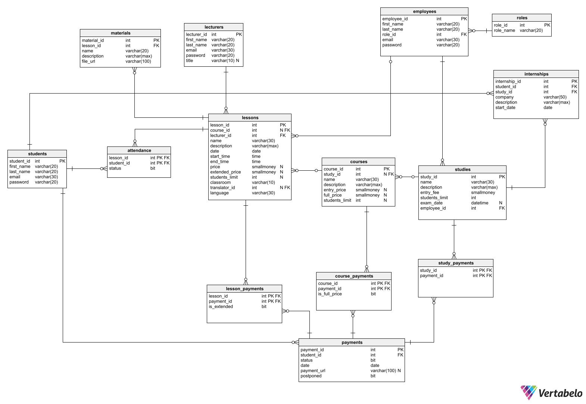

# Bazy danych - System zarządzania szkoleniami
Krzysztof Śliwiński
Hubert Kasprzycki
Artur Dwornik


## Funkcje realizowane przez system:
1. Pracownicy zarządzający wydarzeniami:
    * Zarządzanie kursami, webinarami i studiami: 
        * Dodawanie nowych kursów, webinarów i studiów. 
        * Edycja istniejących wydarzeń (w tym harmonogramu). 
        * Usuwanie wydarzeń (zarówno bieżących, jak i archiwizowanych). 
    * Zarządzanie użytkownikami: 
        * Dodawanie nowych użytkowników do systemu. 
        * Edycja danych użytkowników. 
    * Generowanie raportów: 
        * Raport ogólny z zapisanych osób na przyszłe wydarzenia. 
        * Raport frekwencji na zakończonych wydarzeniach. 
        * Lista obecności dla każdego szkolenia. 
        * Raport bilokacji – lista osób zapisanych na kolidujące ze sobą wydarzenia. 

2. Pracownicy biurowi: 
    * Generowanie raportów: 
        * Raport finansowy - zestawienie przychodów z poszczególnych wydarzeń. 
        * Lista dłużników - sprawozdanie zalegających z płatnościami użytkowników. 
        * Raport ogólny z zapisanych osób na przyszłe wydarzenia. 
        * Raport frekwencji na zakończonych wydarzeniach. 
        * Lista obecności dla każdego szkolenia. 
        * Raport bilokacji – lista osób zapisanych na kolidujące ze sobą wydarzenia. 
	 
 3. Wykładowca: 
    * Edycja prowadzonych wydarzeń. 
    * Oznaczanie obecności: 
        * Oznaczanie obecności uczestników w trakcie spotkań. 
        * Modyfikowanie listy obecności (oznaczenie odrobienia zajęć w przypadku studiów) 
    * Dodawanie materiałów: 
        * Wykładowca może dodawać materiały do kursów, takie jak prezentacje, pliki do pobrania itp. 
 
4.  Uczestnik: 
    * Przeglądanie oferty: 
        * Przeglądanie dostępnych kursów, webinarów i studiów. 
        * Przeglądanie sylabusów studiów, 
    * Rejestracja i płatności: 
        * Rejestracja na wybrane wydarzenia. 
        * Dodawanie wydarzeń do koszyka. 
        * Generowanie linku do płatności. 
        * Uiszczenie opłat za uczestnictwo w wydarzeniach. 
    * Dostęp do nagrań: 
        * Dostęp do nagrań z różnych wydarzeń online. 
        * Przeglądanie dostępnych nagrań przez okres 30 dni. 
    * Przeglądanie danych: 
        * Uczestnik może przeglądać swoje płatności i historię uczestnictwa. 

<div style="page-break-after: always;"></div>

## Diagram bazy danych:




#### Dodatkowe informacje do diagramu
* Wpis w tabeli `internships` oznacza, że student dostarczył zaświadczenie z firmy zewnętrznej o ukończeniu 14 dniowych praktyk ze 100% frekwencją w ramach danych studiów.

## Tabele

### Pracownicy
``` sql
CREATE TABLE employees (
   employee_id int  NOT NULL IDENTITY(1, 1),
   first_name varchar(20)  NOT NULL,
   last_name varchar(20)  NOT NULL,
   role_id int  NOT NULL,
   email varchar(30)  NOT NULL,
   password varchar(20)  NOT NULL,
   CONSTRAINT employees_ak_1 UNIQUE (email),
   CONSTRAINT employees_pk PRIMARY KEY  (employee_id)
);

```
### Role pracowników
``` sql
CREATE TABLE roles (
   role_id int  NOT NULL IDENTITY(1,1),
   role_name varchar(20)  NOT NULL,
   CONSTRAINT roles_pk PRIMARY KEY  (role_id)
);
```

<div style="page-break-after: always;"></div>

### Studenci
``` sql
CREATE TABLE students (
   student_id int  NOT NULL IDENTITY(1, 1),
   first_name varchar(20)  NOT NULL,
   last_name varchar(20)  NOT NULL,
   email varchar(30)  NOT NULL,
   password varchar(20)  NOT NULL,
   CONSTRAINT students_ak_1 UNIQUE (email),
   CONSTRAINT students_pk PRIMARY KEY  (student_id)
);
```

### Lista obecności
``` sql
CREATE TABLE attendance (
   lesson_id int  NOT NULL,
   student_id int  NOT NULL,
   status bit  NOT NULL DEFAULT 0,
   CONSTRAINT attendance_pk PRIMARY KEY  (lesson_id,student_id)
);
```

### Materiały do lekcji online
``` sql
CREATE TABLE materials (
   material_id int  NOT NULL IDENTITY(1, 1),
   lesson_id int  NOT NULL,
   name varchar(20)  NOT NULL,
   description varchar(max)  NOT NULL DEFAULT 'no description found',
   file_url varchar(100)  NOT NULL,
   CONSTRAINT materials_ak_1 UNIQUE (file_url),
   CONSTRAINT materials_pk PRIMARY KEY  (material_id)
);
```

### Wykładowcy
``` sql
CREATE TABLE lecturers (
   lecturer_id int  NOT NULL IDENTITY(1,1),
   first_name varchar(20)  NOT NULL,
   last_name varchar(20)  NOT NULL,
   email varchar(30)  NOT NULL,
   password varchar(20)  NOT NULL,
   title varchar(10)  NULL,
   CONSTRAINT lecturers_ak_1 UNIQUE (email),
   CONSTRAINT lecturers_pk PRIMARY KEY  (lecturer_id)
);
```

### Praktyki zawodowe
``` sql
CREATE TABLE internships (
   internship_id int  NOT NULL IDENTITY(1,1),
   student_id int  NOT NULL,
   study_id int  NOT NULL,
   company varchar(50)  NOT NULL,
   description varchar(max)  NOT NULL DEFAULT 'no description found',
   start_date date  NOT NULL,
   CONSTRAINT Internships_pk PRIMARY KEY  (internship_id)
);
```

<div style="page-break-after: always;"></div>

### Lekcje (z kursów i studiów) i webinary
``` sql
CREATE TABLE lessons (
   lesson_id int  NOT NULL IDENTITY(1, 1),
   course_id int  NULL,
   lecturer_id int  NOT NULL,
   name varchar(30)  NOT NULL,
   description varchar(max)  NOT NULL DEFAULT 'no description found',
   date date  NOT NULL,
   start_time time  NOT NULL,
   end_time time  NOT NULL,
   price smallmoney  NOT NULL DEFAULT 0,
   extended_price smallmoney  NOT NULL DEFAULT 0,
   students_limit int  NULL,
   classroom varchar(10)  NOT NULL,
   translator_id int  NULL,
   language varchar(30)  NOT NULL,
   CONSTRAINT data CHECK (start_time < end_time),
   CONSTRAINT students_limit_lessons CHECK (students_limit > 0),
   CONSTRAINT price CHECK (price >= 0),
   CONSTRAINT extended_price CHECK (extended_price >= price),
   CONSTRAINT lessons_pk PRIMARY KEY  (lesson_id)
);
```

### Kursy
``` sql
CREATE TABLE courses (
   course_id int  NOT NULL IDENTITY(1, 1),
   study_id int  NULL,
   name varchar(30)  NOT NULL,
   description varchar(max)  NOT NULL DEFAULT 'no description found',
   entry_price smallmoney  NOT NULL DEFAULT 0,
   full_price smallmoney  NOT NULL DEFAULT 0,
   students_limit int  NULL,
   CONSTRAINT entry_price CHECK (entry_price >= 0),
   CONSTRAINT full_price CHECK (full_price >= 0),
   CONSTRAINT students_limit_courses CHECK (students_limit > 0),
   CONSTRAINT courses_pk PRIMARY KEY  (course_id)
);
```

### Studia
``` sql
CREATE TABLE studies (
   study_id int  NOT NULL IDENTITY(1, 1),
   name varchar(30)  NOT NULL,
   description varchar(max)  NOT NULL DEFAULT 'no description found',
   entry_fee smallmoney  NOT NULL,
   students_limit int  NOT NULL,
   exam_date datetime  NULL,
   employee_id int  NOT NULL,
   CONSTRAINT entry_fee CHECK (entry_fee > 0),
   CONSTRAINT students_limit_studies CHECK (students_limit > 0),
   CONSTRAINT studies_pk PRIMARY KEY  (study_id)
);
```

### Płatności
``` sql
CREATE TABLE payments (
    payment_id int  NOT NULL IDENTITY(1, 1),
    student_id int  NOT NULL,
    status bit  NOT NULL DEFAULT 0,
    date date  NOT NULL,
    payment_url varchar(100)  NULL,
    postponed bit  NOT NULL,
    CONSTRAINT payments_ak_1 UNIQUE (payment_url),
    CONSTRAINT payments_pk PRIMARY KEY  (payment_id)
);
```

### Płatności za lekcje
``` sql
CREATE TABLE lesson_payments (
    lesson_id int  NOT NULL,
    payment_id int  NOT NULL,
    is_extended bit  NOT NULL,
    CONSTRAINT lesson_payments_pk PRIMARY KEY  (lesson_id,payment_id)
);
```

### Płatności za kursy
``` sql
CREATE TABLE course_payments (
    course_id int  NOT NULL,
    payment_id int  NOT NULL,
    is_full_price bit  NOT NULL DEFAULT 0,
    CONSTRAINT course_payments_pk PRIMARY KEY  (course_id,payment_id)
);
```

### Płatności za studia
``` sql
CREATE TABLE study_payments (
    study_id int  NOT NULL,
    payment_id int  NOT NULL,
    CONSTRAINT study_payments_pk PRIMARY KEY  (study_id,payment_id)
);
```

## Widoki

### 1. Raporty finansowe

#### Przychody dla studiów
```sql
CREATE VIEW studies_income AS
    WITH t AS (select lp.lesson_id, l.price, l.extended_price, s.study_id, lp.is_extended
            FROM lesson_payments lp
                        JOIN lessons l
                            ON lp.lesson_id = l.lesson_id
                        JOIN courses c
                            ON l.course_id = c.course_id
                        JOIN studies s
                            ON c.study_id = s.study_id
                        JOIN payments p
                            ON lp.payment_id = p.payment_id AND p.status = 1)
    SELECT s.study_id,
        ROUND((SELECT COUNT(*)
                FROM study_payments sp
                        JOIN payments p
                            ON sp.payment_id = p.payment_id AND p.status = 1
                WHERE sp.study_id = s.study_id) * s.entry_fee
                    +
                (SELECT ISNULL(SUM(t.price*t.is_extended + t.extended_price*ABS(t.is_extended - 1)), 0)
                FROM t
                WHERE t.study_id = s.study_id)
            , 2) AS income
    FROM studies s
```

#### Przychody dla kursów
```sql
CREATE VIEW courses_income AS
    WITH t AS (SELECT cp.course_id, cp.is_full_price
                FROM course_payments cp
                    JOIN payments p
                        ON cp.payment_id = p.payment_id AND p.status = 1)
    SELECT c.course_id,
        ROUND((SELECT COUNT(*)
                FROM t
                WHERE t.course_id = c.course_id AND t.is_full_price = 1) * c.full_price
                +
            (SELECT COUNT(*)
                FROM t
                WHERE t.course_id = c.course_id AND t.is_full_price = 0) * c.entry_price, 2) AS income
    FROM courses c
    WHERE c.study_id IS NULL
```

<div style="page-break-after: always;"></div>

#### Przychody dla webinarów
```sql
CREATE VIEW webinars_income AS
    WITH t AS (SELECT l.lesson_id, COUNT(lp.lesson_id) as counter
                FROM lessons l
                    JOIN lesson_payments lp
                        ON l.lesson_id = lp.lesson_id
                    JOIN payments p
                        ON lp.payment_id = p.payment_id AND p.status = 1
                WHERE l.course_id IS NULL
                GROUP BY l.lesson_id)
    SELECT t.lesson_id, ROUND(t.counter * l.price, 2) AS income
    FROM t
        JOIN lessons l
            ON l.lesson_id = t.lesson_id
```

### 2. Lista „dłużników”

#### Dłużnicy dla studiów
```sql
CREATE VIEW studies_debtors_list AS
    SELECT DISTINCT s.student_id
    FROM students s
        JOIN attendance a
            ON s.student_id = a.student_id AND a.status = 1
        JOIN lessons l
            ON a.lesson_id = l.lesson_id
        JOIN courses c
            ON l.course_id = c.course_id
        JOIN studies st
            ON c.study_id = st.study_id
        LEFT JOIN payments p
            ON s.student_id = p.student_id
        LEFT JOIN lesson_payments lp
            ON p.payment_id = lp.payment_id AND a.lesson_id = lp.lesson_id
        LEFT JOIN study_payments sp
            ON p.payment_id = sp.payment_id AND st.study_id = sp.study_id
    WHERE p.payment_id IS NULL OR (p.postponed = 0 AND (lp.payment_id IS NULL OR sp.payment_id IS NULL OR p.status = 0))
```

#### Dłużnicy dla kursów
```sql
CREATE VIEW courses_debtors_list AS
    SELECT DISTINCT s.student_id
    FROM students s
        JOIN attendance a
            ON s.student_id = a.student_id AND a.status = 1
        JOIN lessons l
            ON a.lesson_id = l.lesson_id
        JOIN courses c
            ON l.course_id = c.course_id AND c.study_id IS NULL
        LEFT JOIN payments p
            ON s.student_id = p.student_id
        LEFT JOIN course_payments cp
            ON p.payment_id = cp.payment_id AND c.course_id = cp.course_id
    WHERE p.payment_id IS NULL OR (p.postponed = 0 AND (cp.payment_id IS NULL OR p.status = 0 OR cp.is_full_price = 0))
```

#### Dłużnicy dla webinarów
```sql
CREATE VIEW webinars_debtors_list AS
    SELECT DISTINCT s.student_id
    FROM students s
        JOIN attendance a
            ON s.student_id = a.student_id AND a.status = 1
        JOIN lessons l
            ON a.lesson_id = l.lesson_id AND l.course_id is null
        LEFT JOIN payments p
            ON s.student_id = p.student_id
        LEFT JOIN lesson_payments lp
            ON p.payment_id = lp.payment_id AND a.lesson_id = lp.lesson_id
    WHERE p.payment_id IS NULL OR (p.postponed = 0 AND (lp.payment_id IS NULL OR p.status = 0))
```

<div style="page-break-after: always;"></div>

#### Wszyscy dłużnicy
```sql
CREATE VIEW debtors_list AS
    SELECT * FROM webinars_debtors_list
    UNION
    SELECT * FROM courses_debtors_list
    UNION
    SELECT * FROM studies_debtors_list
```

### 3. Ogólny raport dotyczący liczby zapisanych osób na wydarzenia
``` sql
CREATE VIEW students_registered_count AS
    WITH
        studiesStudentsCount AS (
            SELECT s.study_id, count(*) as "count"
            FROM studies s
            JOIN study_payments sp ON s.study_id=sp.study_id
            JOIN payments p ON sp.payment_id=p.payment_id
            WHERE p.[status]=1 OR (p.[status]=0 AND p.postponed=1)
            GROUP BY s.study_id
        ),
        coursesStudentsCount AS (
            SELECT c.course_id, count(*) as "count"
            FROM courses c
            JOIN course_payments cp ON c.course_id=cp.course_id
            JOIN payments p ON cp.payment_id=p.payment_id
            WHERE p.[status]=1 OR (p.[status]=0 AND p.postponed=1)
            GROUP BY c.course_id
        ),
        lessonsStudentsCount AS (
            SELECT l.lesson_id, count(*) as "count"
            FROM lessons l
            JOIN lesson_payments lp ON l.lesson_id=lp.lesson_id
            JOIN payments p ON lp.payment_id=p.payment_id
            WHERE p.[status]=1 OR (p.[status]=0 AND p.postponed=1)
            GROUP BY l.lesson_id
        ),
        extraStudentsCount AS (
            SELECT l.lesson_id, count(*) as "count"
            FROM lessons l
            JOIN lesson_payments lp ON l.lesson_id=lp.lesson_id
            JOIN payments p ON lp.payment_id=p.payment_id
            WHERE lp.is_extended=1 AND (p.[status]=1 OR (p.[status]=0 AND p.postponed=1))
            GROUP BY l.lesson_id
        )
    SELECT 
        l.lesson_id,
        (
            CASE 
                WHEN l.course_id IS NULL THEN lsc.count
                WHEN c.study_id IS NULL THEN csc.count
                ELSE ssc.count + ISNULL(esc.count,0)
            END
        ) AS "count",
        (
            CASE
                WHEN l.classroom='online' THEN 'remote'
                ELSE 'stationary'
            END
        ) as "lesson form"
    FROM lessons l
    LEFT JOIN courses c on l.course_id=c.course_id
    LEFT JOIN studies s on c.study_id=s.study_id
    LEFT JOIN lessonsStudentsCount lsc ON l.lesson_id=lsc.lesson_id
    LEFT JOIN coursesStudentsCount csc ON c.course_id=csc.course_id
    LEFT JOIN studiesStudentsCount ssc ON s.study_id=ssc.study_id
    LEFT JOIN extraStudentsCount esc ON l.lesson_id=esc.lesson_id
```

### 4. Ogólny raport dotyczący liczby zapisanych osób na przyszłe wydarzenia
```sql
CREATE VIEW students_registered_future_count AS (
    SELECT src.lesson_id, src.[count], src.[lesson form] 
    FROM students_registered_count src
    JOIN lessons l ON src.lesson_id=l.lesson_id
    WHERE l.[date] > GETDATE()
)
```

<div style="page-break-after: always;"></div>

### 5. Ogólny raport dotyczący frekwencji na zakończonych już wydarzeniach
``` sql
CREATE VIEW attendance_percentage_report AS 
    WITH 
        attendanceTotal AS (
            SELECT 
                l.lesson_id, 
                COUNT(*) AS count
            FROM lessons l
            JOIN attendance a on l.lesson_id=a.lesson_id
            WHERE l.date < GETDATE()
            GROUP BY l.lesson_id
        ),
        attendancePresent AS (
            SELECT 
                l.lesson_id, 
                COUNT(*) AS count
            FROM lessons l
            JOIN attendance a ON l.lesson_id=a.lesson_id
            WHERE l.date < GETDATE() AND a.[status]=1
            GROUP BY l.lesson_id
        )
    SELECT 
        att.lesson_id,
        CAST((CAST(atp.count AS float)/CAST(att.count AS float)) AS numeric(20,2)) AS "Attendance Percentage"
    FROM attendanceTotal att
    JOIN attendancePresent atp on att.lesson_id=atp.lesson_id

```

### 6. Lista Obecności
``` sql
CREATE VIEW attendance_list AS (
    SELECT 
        l.lesson_id,
        l.[date],
        s.first_name,
        s.last_name,
        (
            CASE
                WHEN a.status=0 THEN 'ABSENT'
                ELSE 'PRESENT'
            END
        ) AS "status"
    FROM lessons l
    JOIN attendance a ON l.lesson_id=a.lesson_id
    JOIN students s ON a.student_id=s.student_id
)
```

### 7. Raport Bilokacji
```sql
CREATE VIEW bilocation_report AS
WITH
myData AS (
    SELECT s.student_id, l.lesson_id, l.[date], start_time, end_time 
    FROM students s
    JOIN payments p ON s.student_id=p.student_id
    JOIN lesson_payments lp ON p.payment_id=lp.payment_id
    JOIN lessons l ON l.lesson_id=lp.lesson_id
    where (p.[status]=1 OR (p.[status]=0 AND p.postponed=1))
)
SELECT DISTINCT md1.student_id
FROM myData md1
JOIN myData md2 ON md1.student_id=md2.student_id
WHERE md1.[date]=md2.[date] AND 
    (
        (md2.start_time > md1.start_time AND md1.end_time > md2.start_time) 
    OR 
        (md1.start_time > md2.start_time AND md2.end_time > md1.start_time)
    )
```

<div style="page-break-after: always;"></div>

## Procedury

### 1. Wyświetl koszyk danego użytkownika (lekcje)
```sql
CREATE PROCEDURE student_cart_lessons_info(@student_id INT)
AS
BEGIN
    BEGIN TRY
        IF NOT EXISTS(
            SELECT * 
            FROM students
            WHERE @student_id=student_id
        )
        BEGIN
            THROW 53000, N'There is no student with given ID', 1
        END
        SELECT 
            l.lesson_id, 
            l.name, 
            l.[description], 
            l.[date], 
            l.start_time, 
            l.end_time, 
            CASE
                WHEN lp.is_extended=1 THEN l.extended_price
                ELSE l.price
            END AS "price",
            l.classroom,
            l.[language]
        FROM payments p
        JOIN lesson_payments lp ON p.payment_id=lp.payment_id
        JOIN lessons l ON l.lesson_id=lp.lesson_id
        WHERE p.student_id=@student_id AND p.payment_url IS NULL
    END TRY
    BEGIN CATCH
        DECLARE @msg NVARCHAR(2048) = N'ERROR: ' + ERROR_MESSAGE();
        THROW 53000, @msg, 1;
    END CATCH
END
```

### 2. Wyświetl koszyk danego użytkownika (kursy)
```sql
CREATE PROCEDURE student_cart_courses_info(@student_id INT)
AS
BEGIN
    BEGIN TRY
        IF NOT EXISTS(
            SELECT * 
            FROM students
            WHERE @student_id=student_id
        )
        BEGIN
            THROW 53000, N'There is no student with given ID', 1
        END
        SELECT 
            c.course_id,
            c.name, 
            c.[description],
            c.entry_price
        FROM payments p
        JOIN course_payments cp ON p.payment_id=cp.payment_id
        JOIN courses c ON c.course_id=cp.course_id
        WHERE p.student_id=@student_id AND p.payment_url IS NULL
    END TRY
    BEGIN CATCH
        DECLARE @msg NVARCHAR(2048) = N'ERROR: ' + ERROR_MESSAGE();
        THROW 53000, @msg, 1;
    END CATCH
END
```

<div style="page-break-after: always;"></div>

### 3. Wyświetl koszyk danego użytkownika (studia)
```sql
CREATE PROCEDURE student_cart_studies_info(@student_id INT)
AS
BEGIN
    BEGIN TRY
        IF NOT EXISTS(
            SELECT * 
            FROM students
            WHERE @student_id=student_id
        )
        BEGIN
            THROW 53000, N'There is no student with given ID', 1
        END
        SELECT 
            s.study_id, 
            s.name,
            s.[description],
            s.entry_fee,
            s.exam_date
        FROM payments p
        JOIN study_payments sp ON p.payment_id=sp.payment_id
        JOIN studies s ON s.study_id=sp.study_id
        WHERE p.student_id=@student_id AND p.payment_url IS NULL
    END TRY
    BEGIN CATCH
        DECLARE @msg NVARCHAR(2048) = N'ERROR: ' + ERROR_MESSAGE();
        THROW 53000, @msg, 1;
    END CATCH
END
```

### 4. Przeglądaj historię uczestnictwa
```sql
CREATE PROCEDURE student_attendance_history(@student_id INT)
AS
BEGIN
    BEGIN TRY
        IF NOT EXISTS(
            SELECT * 
            FROM students
            WHERE @student_id=student_id
        )
        BEGIN
            THROW 53000, N'There is no student with given ID', 1
        END
        SELECT 
            l.lesson_id,
            l.name,
            l.[date]
        FROM attendance a
        JOIN lessons l ON a.lesson_id=l.lesson_id
        WHERE a.student_id=@student_id AND a.[status]=1
        ORDER BY l.[date] ASC
    END TRY
    BEGIN CATCH
        DECLARE @msg NVARCHAR(2048) = N'ERROR: ' + ERROR_MESSAGE();
        THROW 53000, @msg, 1;
    END CATCH
END
```

<div style="page-break-after: always;"></div>

### 5. Aktualizuj obecność
```sql
CREATE PROCEDURE update_attendance(@lesson_id INT, @student_id INT)
AS
BEGIN
    BEGIN TRY
        IF NOT EXISTS(
            SELECT *
            FROM attendance
            WHERE lesson_id=@lesson_id
        )
        BEGIN
            THROW 53000, N'There is no lesson with given ID', 1
        END
        IF NOT EXISTS(
            SELECT *
            FROM students
            WHERE student_id=@student_id
        )
        BEGIN
            THROW 53000, N'There is no student with given ID', 1
        END
        IF NOT EXISTS(
            SELECT *
            FROM attendance
            WHERE student_id=@student_id
        )
        BEGIN
            THROW 53000, N'There is no attendance for student with given ID', 1
        END
        UPDATE attendance
        SET [status]=1
        WHERE lesson_id=@lesson_id AND student_id=@student_id
    END TRY
    BEGIN CATCH
        DECLARE @msg NVARCHAR(2048) = N'ERROR: ' + ERROR_MESSAGE();
        THROW 53000, @msg, 1
    END CATCH
END
```

<div style="page-break-after: always;"></div>

### 6. Dodaj lekcję ze studiów
```sql
CREATE PROCEDURE add_study_lesson(
    @lecturer_id INT,
    @course_id INT,
    @name VARCHAR(30),
    @date DATE,
    @start_time TIME,
    @end_time TIME,
    @classroom VARCHAR(10),
    @language VARCHAR(30),
    @description VARCHAR(max) = 'No description',
    @price SMALLMONEY = 0,
    @extended_price SMALLMONEY = 0,
    @students_limit INT = null,
    @translator_id INT = null
)
AS
BEGIN
    BEGIN TRY
        IF NOT exists(select * from lecturers where lecturer_id = @lecturer_id)
            BEGIN
                THROW 53000, N'Uknown lecturer!', 1;
            END

        IF NOT exists(select * from courses where course_id = @course_id and study_id is not null)
            BEGIN
                THROW 53000, N'Uknown course or course is not from any studies!', 1;
            END

        IF @language <> 'Polish' and @translator_id is null
            BEGIN
               THROW 53000, N'Lack of translator', 1;
            END

        IF @classroom = 'Online' and @students_limit is not null
            BEGIN
                THROW 53000, N'Online lessons cannot be limited', 1;
            END

        DECLARE @study_students_limit INT
        SET @study_students_limit = (select s.students_limit
                                    from studies s
                                    where s.study_id = (select c.study_id
                                                        from courses c
                                                        where c.course_id = @course_id))

        IF @students_limit is not null and @students_limit < @study_students_limit
            BEGIN
                THROW 53000, N'Incorrect students limit, limit is less than study limit', 1;
            end

        INSERT INTO lessons (lecturer_id, name, description, date, start_time, end_time, price, extended_price, students_limit,
                             classroom, translator_id, language)
        VALUES (@lecturer_id, @name, @description, @date, @start_time, @end_time, @price, @extended_price, @students_limit, @classroom,
                @translator_id, @language)
    END TRY
    BEGIN CATCH
        DECLARE @msg VARCHAR(2048) = N'ERROR: ' + ERROR_MESSAGE();
        THROW 53000, @msg, 1;
    END CATCH
END
```

<div style="page-break-after: always;"></div>

### 7. Dodaj lekcję z kursu
```sql
CREATE PROCEDURE add_course_lesson(
    @lecturer_id INT,
    @course_id INT,
    @name VARCHAR(30),
    @date DATE,
    @start_time TIME,
    @end_time TIME,
    @classroom VARCHAR(10),
    @language VARCHAR(30),
    @description VARCHAR(max) = 'No description',
    @translator_id INT = null
)
AS
BEGIN
    BEGIN TRY
        IF NOT exists(select * from lecturers where lecturer_id = @lecturer_id)
            BEGIN
                THROW 53000, N'Uknown lecturer!', 1;
            END

        IF NOT exists(select * from courses where course_id = @course_id and study_id is null)
            BEGIN
                THROW 53000, N'Uknown course', 1;
            END

        IF @language <> 'Polish' and @translator_id is null
            BEGIN
               THROW 53000, N'Lack of translator', 1;
            END

        DECLARE @course_students_limit INT
        SET @course_students_limit = (select c.students_limit
                                    from courses c
                                    where c.course_id = @course_id)

        INSERT INTO lessons (lecturer_id, name, description, date, start_time, end_time, students_limit,
                             classroom, translator_id, language)
        VALUES (@lecturer_id, @name, @description, @date, @start_time, @end_time, @course_students_limit, @classroom,
                @translator_id, @language)
    END TRY
    BEGIN CATCH
        DECLARE @msg VARCHAR(2048) = N'ERROR: ' + ERROR_MESSAGE();
        THROW 53000, @msg, 1;
    END CATCH
END
```

<div style="page-break-after: always;"></div>

### 8. Dodaj webinar
```sql
CREATE PROCEDURE add_webinar(
    @lecturer_id INT,
    @name VARCHAR(30),
    @date DATE,
    @start_time TIME,
    @end_time TIME,
    @classroom VARCHAR(10),
    @language VARCHAR(30),
    @description VARCHAR(max) = 'No description',
    @price SMALLMONEY = 0,
    @students_limit INT = null,
    @translator_id INT = null
)
AS
BEGIN
    BEGIN TRY
        IF NOT exists(select * from lecturers where lecturer_id = @lecturer_id)
            BEGIN
                THROW 53000, N'Uknown lecturer!', 1;
            END

        IF @language <> 'Polish' and @translator_id is null
            BEGIN
               THROW 53000, N'Lack of translator', 1;
            END

        IF @classroom = 'Online' and @students_limit is not null
            BEGIN
                THROW 5300, N'Online lessons cannot be limited', 1;
            END

        INSERT INTO lessons (lecturer_id, name, description, date, start_time, end_time, price, extended_price, students_limit,
                             classroom, translator_id, language)
        VALUES (@lecturer_id, @name, @description, @date, @start_time, @end_time, @price, @price, @students_limit, @classroom,
                @translator_id, @language)
    END TRY
    BEGIN CATCH
        DECLARE @msg VARCHAR(2048) = N'ERROR: ' + ERROR_MESSAGE();
        THROW 53000, @msg, 1;
    END CATCH
END
```

<div style="page-break-after: always;"></div>

### 9. Dodawanie lekcji do koszyka
```sql
CREATE PROCEDURE add_lesson_to_cart(@payment_id INT, @lesson_id INT, @student_id INT)
AS
BEGIN
    BEGIN TRY
        IF NOT EXISTS(
            SELECT *
            FROM payments
            WHERE payment_id=@payment_id
        )
        BEGIN
            THROW 53000, N'There is no payment with given ID', 1
        END
        IF NOT EXISTS(
            SELECT *
            FROM students
            WHERE student_id=@student_id
        )
        BEGIN
            THROW 53000, N'There is no student with given ID', 1
        END
        IF NOT EXISTS(
            SELECT *
            FROM lessons
            WHERE lesson_id=@lesson_id
        )
        BEGIN
            THROW 53000, N'There is no lesson with given ID', 1
        END
        DECLARE @is_extended INT
        DECLARE @lesson_studies INT
        SET @is_extended = 0
        SET @lesson_studies = dbo.get_lesson_studies(@lesson_id)
        IF(@lesson_studies IS NOT NULL)
            BEGIN
                IF (
                    NOT EXISTS( 
                    SELECT p.payment_id 
                    FROM study_payments sp 
                    JOIN payments p ON sp.payment_id=p.payment_id
                    WHERE p.student_id=@student_id 
                    AND (p.[status]=1 OR p.postponed=1)
                    AND dbo.get_lesson_studies(@lesson_id)=sp.study_id
                    ) 
                )
                BEGIN
                    SET @is_extended=1
                END
            END
        IF (SELECT p.status FROM payments p WHERE p.payment_id=@payment_id)=0 
            AND dbo.calc_lesson_vacancy_amount(@lesson_id) > 0
        BEGIN
            IF NOT(
                (SELECT l.course_id FROM lessons l WHERE l.lesson_id=@lesson_id) IS NOT NULL
                AND @lesson_studies IS NULL
                )
            BEGIN
                INSERT INTO lesson_payments(lesson_id, payment_id, is_extended)
                VALUES (@lesson_id, @payment_id, @is_extended)
            END
        END
    END TRY
    BEGIN CATCH
        DECLARE @msg NVARCHAR(2048) = N'ERROR: ' + ERROR_MESSAGE();
        THROW 53000, @msg, 1
    END CATCH
END
```

<div style="page-break-after: always;"></div>

### 10. Dodawanie kursu do koszyka
```sql
CREATE PROCEDURE add_course_to_cart(@payment_id INT, @course_id INT, @student_id INT, @is_full_price INT)
AS
BEGIN
    BEGIN TRY
        IF NOT EXISTS(
            SELECT *
            FROM payments
            WHERE payment_id=@payment_id
        )
        BEGIN
            THROW 53000, N'There is no payment with given ID', 1
        END
        IF NOT EXISTS(
            SELECT *
            FROM students
            WHERE student_id=@student_id
        )
        BEGIN
            THROW 53000, N'There is no student with given ID', 1
        END
        IF NOT EXISTS(
            SELECT *
            FROM courses
            WHERE course_id=@course_id
        )
        BEGIN
            THROW 53000, N'There is no course with given ID', 1
        END

        DECLARE @course_studies INT
        SET @course_studies = (SELECT c.study_id FROM courses c WHERE c.course_id=@course_id)

        IF (SELECT p.status FROM payments p WHERE p.payment_id=@payment_id)=0 
            AND dbo.calc_course_vacancy_amount(@course_id) > 0
            AND @course_studies IS NULL
        BEGIN
            INSERT INTO course_payments(course_id, payment_id, is_full_price)
            VALUES (@course_id, @payment_id, @is_full_price)
        END
        
    END TRY
    BEGIN CATCH
        DECLARE @msg NVARCHAR(2048) = N'ERROR: ' + ERROR_MESSAGE();
        THROW 53000, @msg, 1
    END CATCH
END
```

<div style="page-break-after: always;"></div>

### 11. Dodawanie studiów do koszyka
```sql
CREATE PROCEDURE add_study_to_cart(@payment_id INT, @study_id INT, @student_id INT)
AS
BEGIN
    BEGIN TRY
        IF NOT EXISTS(
            SELECT *
            FROM payments
            WHERE payment_id=@payment_id
        )
        BEGIN
            THROW 53000, N'There is no payment with given ID', 1
        END
        IF NOT EXISTS(
            SELECT *
            FROM students
            WHERE student_id=@student_id
        )
        BEGIN
            THROW 53000, N'There is no student with given ID', 1
        END
        IF NOT EXISTS(
            SELECT *
            FROM studies
            WHERE study_id=@study_id
        )
        BEGIN
            THROW 53000, N'There is no study with given ID', 1
        END

        IF (SELECT p.status FROM payments p WHERE p.payment_id=@payment_id)=0 
            AND dbo.calc_study_vacancy_amount(@study_id) > 0
        BEGIN
            INSERT INTO study_payments(study_id, payment_id)
            VALUES (@study_id, @payment_id)
        END
        
    END TRY
    BEGIN CATCH
        DECLARE @msg NVARCHAR(2048) = N'ERROR: ' + ERROR_MESSAGE();
        THROW 53000, @msg, 1
    END CATCH
END
```

## Funkcje

### 1. Obliczanie wolnych miejsc na danych studiach
```sql
CREATE FUNCTION calc_study_vacancy_amount(@study_id INT)
    RETURNS INT
        AS
        BEGIN
            RETURN
            (
                SELECT s.students_limit - COUNT(*)
                FROM studies s
                JOIN study_payments sp ON s.study_id=sp.study_id
                JOIN payments p ON p.payment_id=sp.payment_id
                WHERE s.study_id=@study_id AND (p.[status]=1 OR p.postponed=1)
                GROUP BY s.students_limit
            )
        END
```

<div style="page-break-after: always;"></div>

### 2. Obliczanie wolnych miejsc na danym kursie
```sql
CREATE FUNCTION calc_course_vacancy_amount(@course_id INT)
    RETURNS INT
        AS
        BEGIN
            DECLARE @result INT
            DECLARE @course_study_id INT
            SET @course_study_id = (SELECT c.study_id FROM courses c WHERE c.course_id=@course_id)
            IF @course_study_id IS NOT NULL
                BEGIN
                    SET @result = dbo.calc_study_vacancy_amount(@course_study_id)
                END
            ELSE
                SET @result = (
                    SELECT 
                        c.students_limit - COUNT(*)
                    FROM courses c
                    LEFT JOIN course_payments cp ON c.course_id=cp.course_id
                    LEFT JOIN payments p ON p.payment_id=cp.payment_id
                    WHERE c.course_id=@course_id AND (p.[status]=1 OR p.postponed=1)
                    GROUP BY c.students_limit
                )
            RETURN @result
        END
```

### 3. Obliczanie wolnych miejsc na danej lekcji
```sql
CREATE FUNCTION calc_lesson_vacancy_amount(@lesson_id INT)
    RETURNS INT
        AS
        BEGIN
            DECLARE @result INT
            DECLARE @MAXINT INT
            SET @MAXINT = 2147483647
            SET @result = (
                    SELECT l.students_limit - COUNT(*)
                    FROM lessons l
                    LEFT JOIN lesson_payments lp ON l.lesson_id=lp.lesson_id
                    LEFT JOIN payments p ON p.payment_id=lp.payment_id
                    WHERE l.lesson_id=@lesson_id AND (p.[status]=1 OR p.postponed=1)
                    GROUP BY l.students_limit
                )
            IF @result IS NULL
                BEGIN
                    SET @result = (SELECT students_limit FROM lessons WHERE lesson_id=@lesson_id)
                END
            IF @result IS NULL
                SET @result=@MAXINT
            RETURN @result
        END
```

### 4. Szukanie id studiów do których należy lekcja
```sql
CREATE FUNCTION get_lesson_studies(@lesson_id INT)
    RETURNS INT
        AS
        BEGIN
            DECLARE @lesson_course_id INT
            SET @lesson_course_id = (SELECT l.course_id FROM lessons l WHERE l.lesson_id=@lesson_id)
            IF @lesson_course_id IS NULL
                BEGIN
                    RETURN NULL
                END
            RETURN ( SELECT c.study_id FROM courses c WHERE c.course_id=@lesson_course_id)
        END
```

## Triggery

### 1. Trigger usuwający zaliczkę po wpłynięciu płatności za całość kursu
```sql
CREATE TRIGGER trigger_remove_prev_partial_payments
ON course_payments
AFTER INSERT
AS
BEGIN
    SET NOCOUNT ON;

    IF EXISTS (SELECT 1 FROM inserted WHERE is_full_price = 1)
    BEGIN
        DECLARE @course_id INT;
        DECLARE @payment_id INT;

        SELECT @course_id = course_id, @payment_id = payment_id
        FROM inserted
        WHERE is_full_price = 1;

        DELETE FROM course_payments
        WHERE course_id = @course_id
          AND payment_id = @payment_id
          AND is_full_price = 0;
    END
END;
```
### 2. Trigger dodający wpis o obecności na zajęciach po zapłaceniu za te zajęcia
```sql
CREATE TRIGGER tr_generate_attendance
    ON payments
    AFTER INSERT, UPDATE
    AS
BEGIN
    SET NOCOUNT ON
    DECLARE @status INT
    select @status = status from inserted

    IF @status = 1
        BEGIN
            DECLARE @payment_id INT
            DECLARE @student_id INT
            SELECT @payment_id = payment_id, @student_id = student_id from inserted

            -- add attendance for webinars and study lessons
            DECLARE @lesson_id INT

            DECLARE lessons_cursor CURSOR FOR
            SELECT lesson_id FROM lesson_payments WHERE payment_id = @payment_id

            OPEN lessons_cursor

            FETCH NEXT FROM lessons_cursor INTO @lesson_id

            WHILE @@FETCH_STATUS = 0
                BEGIN
                    INSERT INTO attendance (lesson_id, student_id)
                    VALUES (@lesson_id, @student_id)

                    FETCH NEXT FROM lessons_cursor INTO @lesson_id
                END
            CLOSE lessons_cursor
            DEALLOCATE lessons_cursor

            -- add attendance for course lessons
            DECLARE @course_id INT

            DECLARE course_cursor CURSOR FOR
            SELECT course_id FROM course_payments WHERE payment_id = @payment_id

            OPEN course_cursor

            FETCH NEXT FROM course_cursor INTO @course_id

            WHILE @@FETCH_STATUS = 0
                BEGIN
                    DECLARE lessons_cursor CURSOR FOR
                    SELECT lesson_id FROM lessons WHERE course_id = @course_id

                    OPEN lessons_cursor
                    FETCH NEXT FROM lessons_cursor INTO @lesson_id

                    WHILE @@FETCH_STATUS = 0
                        BEGIN
                            INSERT INTO attendance (lesson_id, student_id)
                            VALUES (@lesson_id, @student_id)

                            FETCH NEXT FROM lessons_cursor INTO @lesson_id
                        END
                    CLOSE lessons_cursor
                    DEALLOCATE lessons_cursor

                    FETCH NEXT FROM course_cursor INTO @course_id
                END
            CLOSE course_cursor
            DEALLOCATE course_cursor
        END
END;
```

## Role

### 1. Admin
```sql
CREATE ROLE admin
GRANT ALL PRIVILEGES ON u_ksliwins.dbo TO admin 
```

### 2. Pracownik zarządzający wydarzeniami
```sql
CREATE ROLE event_manager

GRANT EXECUTE ON add_study_lesson TO event_manager
GRANT EXECUTE ON add_course_lesson TO event_manager
GRANT EXECUTE ON add_webinar TO event_manager
GRANT UPDATE ON lessons TO event_manager
GRANT DELETE ON lessons TO event_manager
GRANT INSERT ON courses TO event_manager
GRANT UPDATE ON courses TO event_manager
GRANT DELETE ON courses TO event_manager
GRANT INSERT ON studies TO event_manager
GRANT UPDATE ON studies TO event_manager
GRANT DELETE ON studies TO event_manager
GRANT INSERT ON students TO event_manager
GRANT UPDATE ON students TO event_manager
GRANT SELECT ON students_registered_count TO event_manager
GRANT SELECT ON students_registered_future_count TO event_manager
GRANT SELECT ON attendance_percentage_report TO event_manager
GRANT SELECT ON attendance_list TO event_manager
GRANT SELECT ON bilocation_report TO event_manager
```

### 3. Pracownik biurowy
```sql
CREATE ROLE office_worker

GRANT SELECT ON webinars_income TO office_worker
GRANT SELECT ON courses_income TO office_worker
GRANT SELECT ON studies_income TO office_worker
GRANT SELECT ON students_registered_count TO office_worker
GRANT SELECT ON debtors_list TO office_worker
GRANT SELECT ON webinars_debtors_list TO office_worker
GRANT SELECT ON studies_debtors_list TO office_worker
GRANT SELECT ON students_registered_count TO office_worker
GRANT SELECT ON students_registered_future_count TO office_worker
GRANT SELECT ON attendance_percentage_report TO office_worker
GRANT SELECT ON attendance_list TO office_worker
GRANT SELECT ON bilocation_report TO office_worker
```

### 4. Wykładowca
```sql
CREATE ROLE lecturer

GRANT EXECUTE update_attendance TO lecturer
GRANT INSERT ON attendance TO lecturer
GRANT UPDATE ON attendance TO lecturer
GRANT INSERT ON materials TO lecturer
GRANT UPDATE ON materials TO lecturer
GRANT DELETE ON materials TO lecturer
GRANT SELECT ON attendance_list TO lecturer
```

### 5. Student
```sql
CREATE ROLE student

GRANT EXECUTE ON add_lesson_to_cart TO student
GRANT EXECUTE ON add_course_to_cart TO student
GRANT EXECUTE ON add_study_to_cart TO student
GRANT EXECUTE ON student_attendance_history TO student
GRANT EXECUTE ON student_cart_lessons_info TO student
GRANT EXECUTE ON student_cart_courses_info TO student
GRANT EXECUTE ON student_cart_studies_info TO student
GRANT SELECT ON materials TO student
```

## Indeksy

```sql
CREATE UNIQUE INDEX students_pk
ON students (student_id)

CREATE UNIQUE INDEX employees_pk
ON employees (employee_id)

CREATE UNIQUE INDEX lecturers_pk
ON lecturers (lecturer_id)

CREATE UNIQUE INDEX studies_pk
ON studies (study_id)

CREATE UNIQUE INDEX courses_pk
ON courses (course_id)

CREATE UNIQUE INDEX lessons_pk
ON lessons (lesson_id)

CREATE UNIQUE INDEX payments_pk
ON payments (payment_id)

CREATE UNIQUE INDEX materials_pk
ON materials (material_id)

CREATE UNIQUE INDEX internships_pk
ON internships (internship_id)

CREATE UNIQUE INDEX roles_pk
ON roles (role_id);

CREATE UNIQUE INDEX attendance_pk
ON attendance (student_id, lesson_id)

CREATE UNIQUE INDEX study_payments_pk
ON study_payments (study_id, payment_id)

CREATE UNIQUE INDEX course_payments_pk
ON course_payments (course_id, payment_id)

CREATE UNIQUE INDEX lesson_payments_pk
ON lesson_payments (lesson_id, payment_id)

CREATE UNIQUE INDEX students_email
ON students (email)

CREATE UNIQUE INDEX lecturers_email
ON lecturers (email)

CREATE UNIQUE INDEX employees_email
ON employees (email)

CREATE UNIQUE INDEX file_url
ON materials (file_url)

CREATE UNIQUE INDEX payment_url
ON payments (payment_url)
```